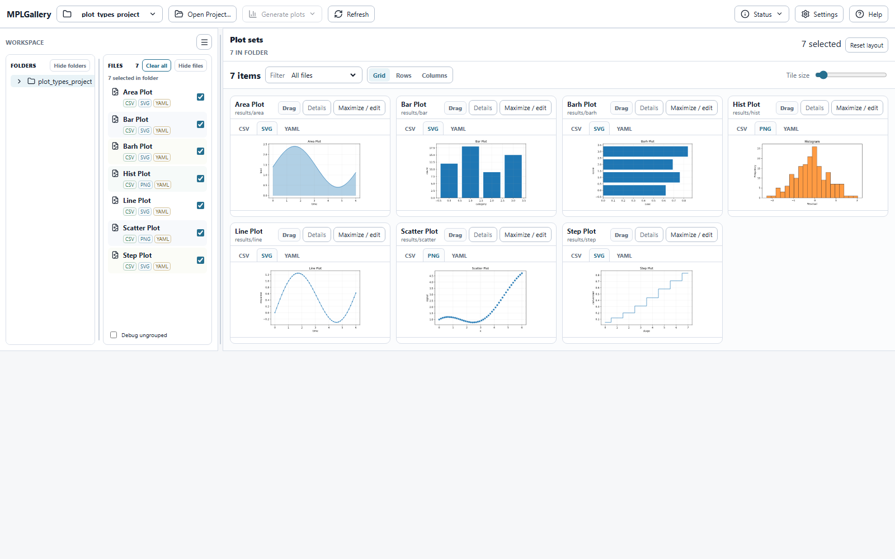
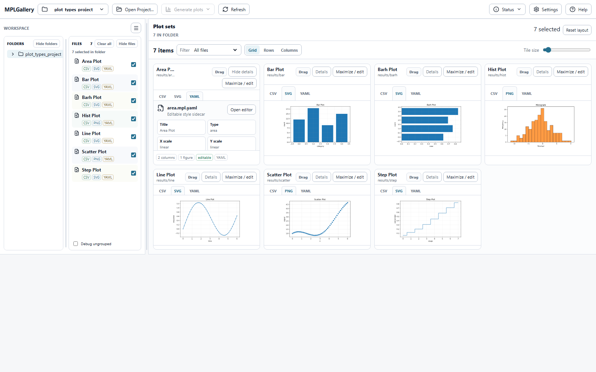
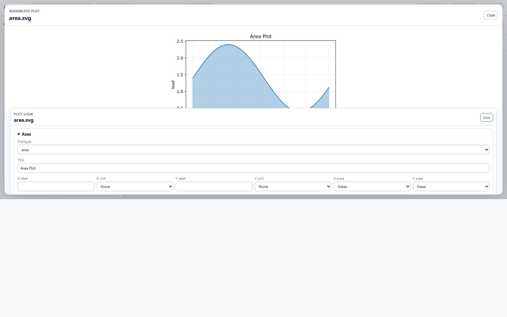

# MPLGallery

<p>
  
</p>

MPLGallery is a local Windows and Python app for browsing Matplotlib plot
outputs inside analysis projects. It treats a plot as a small folder of related
files: CSV snapshots, PNG/SVG/PDF figures, `.mpl.yaml` style metadata, and
optional provenance files.

It is meant for scientists, engineers, and Python users who already generate
figures with scripts and want a cleaner way to inspect, compare, select, and
lightly edit plot appearance without turning their analysis code into a web
application.

## Screenshots

Browse a project, select plot sets, and compare the generated figures in one
gallery view:



Open a plot-set sidecar to inspect the YAML-backed metadata that connects a
figure, its data snapshot, and editable Matplotlib settings:



Use the maximized plot view to inspect a figure and adjust plot appearance
metadata such as title, labels, scales, figure settings, and series style:



## What It Does

- Opens a project folder and discovers plot sets under `results/**`.
- Shows folders and plot files in an IDE-style explorer.
- Groups each figure with its CSV snapshots, images, and `.mpl.yaml` sidecar.
- Previews CSV-backed Matplotlib plots and existing PNG/SVG references.
- Lets you edit appearance metadata such as labels, limits, colors, markers,
  line styles, figure size, grid, and legend settings.
- Persists metadata edits to `.mpl.yaml` files when a plot set is editable.
- Provides a packaged Windows desktop app with Start Menu shortcuts, an app
  icon, and update prompts.

## What It Does Not Do

MPLGallery does not fit models, tune parameters, run arbitrary computation, or
change source CSV data. Your project scripts remain responsible for generating
scientific results and final figures. MPLGallery is the local review and
appearance-management layer around those outputs.

## Who It Is For

Use MPLGallery when your project looks roughly like this:

```text
analysis_project/
  scripts/
    generate_results.py
    render_figures.py
  data/
    input/
    raw/
    processed/
  results/
    response_curve/
      response_curve.csv
      response_curve.svg
      response_curve.png
      response_curve.mpl.yaml
    regression_fit/
      model_curve.csv
      literature_points.csv
      regression_fit.svg
      regression_fit.mpl.yaml
```

The important idea is one folder per figure or figure family under
`results/<plot_set>/`. Each folder should contain the plotted data snapshot and
the figure files that belong together.

## Install The Windows App

The easiest path for normal Windows use does not require Python.

1. Open the latest GitHub Release:
   [MPLGallery releases](https://github.com/tannerpolley/mplgallery/releases)
2. Download the setup executable:
   `MPLGallery.Setup.exe`
3. Run the setup executable.
4. Search for **MPLGallery** in the Windows Start menu.
5. Pin it to the taskbar if you want it to behave like a normal desktop app.

The local build output is named `MPLGallery Setup.exe`; GitHub release assets may
show the same file as `MPLGallery.Setup.exe`.

The installer copies the app to:

```text
%LOCALAPPDATA%\Programs\MPLGallery\mplgallery-desktop.exe
```

It also creates:

- a Start Menu shortcut;
- a Desktop shortcut;
- an app icon suitable for Windows search and taskbar pinning.

Because the app is not code-signed yet, Windows SmartScreen may warn the first
time you run the installer. That warning is about publisher identity, not a
Python dependency problem.

## Updates

The packaged desktop app checks GitHub Releases for newer Windows builds. When
a newer release exists, the app bar shows an update button.

Current update behavior:

- the app finds the newest release;
- downloads the Windows ZIP asset;
- extracts the update into a local staging folder;
- runs the bundled installer helper;
- closes the old running app if needed;
- installs the new EXE and relaunches MPLGallery.

The setup executable is still the cleanest first install path. After that,
future update prompts are handled from inside the app.

## Run With Python

Python users can also install and run MPLGallery as a package.

Install from GitHub:

```bash
pip install git+https://github.com/tannerpolley/mplgallery.git
```

Run from a project root:

```bash
mplgallery run .
```

Start from a folder chooser:

```bash
mplgallery run --choose-root
```

Open in a native Windows desktop window from a Python environment:

```bash
pip install "mplgallery[desktop]"
mplgallery desktop .
```

Use browser mode when you want normal web tooling or automation:

```bash
mplgallery run .
mplgallery serve .
mplgallery desktop . --browser
```

## Basic Workflow

1. Generate results and figures with your normal project scripts.
2. Open the project root in MPLGallery.
3. Select plot sets in the file pane.
4. Review the generated figures and CSV snapshots.
5. Edit appearance metadata when a `.mpl.yaml` sidecar is available.
6. Rerun your project render script when you want final publication artifacts.

MPLGallery can only run render commands that are explicitly declared in the
`.mpl.yaml` sidecar. It does not infer and run arbitrary Python scripts.

## `.mpl.yaml` Sidecars

Matplotlib does not read `.mpl.yaml` by itself. Your render script should load
the sidecar and apply the settings before saving the figure.

Example:

```yaml
version: 1
plot_id: response_curve
title: Response curve
files:
  figures:
    - response_curve.svg
    - response_curve.png
  data:
    - response_curve.csv
render:
  command: uv run python scripts/render_figures.py --plot response_curve
matplotlib:
  kind: line
  x: time_s
  title: Response curve
  xlabel: Time
  xlabel_unit: "$\\mathrm{s}$"
  ylabel: Response
  grid: true
  legend_location: best
  figure:
    width_inches: 6
    height_inches: 4
    dpi: 150
  series:
    - y: response
      label: Model
      color: "#1f77b4"
      linestyle: "-"
      marker: "o"
```

Editable plot sets are the ones with enough metadata for MPLGallery to connect
the visible figure, plotted CSV data, and Matplotlib style settings.

## Command Line Tools

Scan a project:

```bash
mplgallery scan /path/to/project
mplgallery scan /path/to/project --json
```

Validate manifest references:

```bash
mplgallery validate /path/to/project
```

Initialize a compatibility CSV workspace:

```bash
mplgallery init /path/to/project/data
```

Create compatibility draft plots for standalone CSV folders:

```bash
mplgallery draft /path/to/project/data
mplgallery draft /path/to/project/data --json
```

Import existing PNG/SVG reference folders:

```bash
mplgallery import-artifacts /path/to/project/legacy/plots
```

Import an existing ePC-SAFT-style plot manifest:

```bash
mplgallery import-manifest docs/plots/manifest.json --format epcsaft --project-root .
```

## Example Projects

Run the bundled examples:

```bash
uv run mplgallery run examples
```

Useful fixtures:

- `examples/plot_set_project`: canonical `results/<plot_set>/` layout.
- `examples/plot_types_project`: line, scatter, bar, area, histogram, and step examples.
- `examples/subplot_management_project`: subplot-style examples.
- `examples/install_smoke_project`: minimal wheel/install smoke-test project.

## Developer Setup

Use `uv` for local development:

```bash
uv sync --dev
uv run pytest
uv run ruff check .
```

Build the Python package:

```bash
uv run python -m build
```

Build the Windows desktop app and setup executable from Windows:

```bash
uv sync --extra desktop --group windows-dist
uv run python scripts/build_windows_dist.py
```

That produces:

```text
dist/windows/mplgallery-desktop.exe
dist/windows/MPLGallery Setup.exe
dist/windows/mplgallery-desktop-<version>-windows-<arch>.zip
dist/windows/mplgallery-desktop-build.json
```

The build script verifies the generated EXE with a self-test and a smoke test
before writing the build report.

## Release Assets

Tagged GitHub releases publish:

- Python wheel and source archive;
- `MPLGallery.Setup.exe` for normal Windows installation;
- `mplgallery-desktop-<version>-windows-<arch>.zip` for update delivery;
- `mplgallery-desktop.exe` for direct testing;
- `mplgallery-desktop-build.json` with build verification metadata.

The app update checker prefers the Windows desktop ZIP because it contains the
installer helper files needed for in-app updates.

## Safety Model

- Source CSVs are not mutated by default.
- Plot-set CSV snapshots are not overwritten by default.
- `.mplgallery/cache` is app cache, not project output.
- Existing PNG/SVG/PDF files can be browsed as references.
- Static gallery browsing is read-only.
- Metadata edits are written to `.mpl.yaml` sidecars.
- Future overwrite actions should create backups first.

## More Project Notes

For repo-local development environment details, see:

[docs/development_environment.md](docs/development_environment.md)
